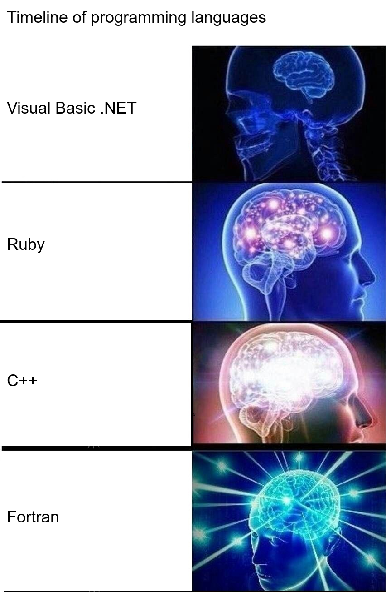

# Auto-expanding Brain



Scrapes Wikipedia, makes memes.

# Running the thing

```
bundle install
probably create an output directory or something
ruby scrape.rb
```

Special bonus feature: this repo also includes some shit I tried to do with randomly generating text instead of scraping Wikipedia.
